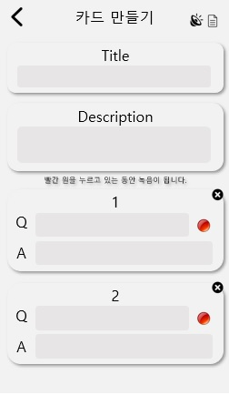

# Quiz Let APP Service

## Description

- 카드를 이용한 암기 학습 도움 앱 서비스

## IA


## Environment

- OS : Windows
- IDE : pycharm
- Version : Python 3.6.1


## Prerequisite

- Make a virtual environment

  ```shell
  $ cd quizlet
  $ python -m venv myvenv
  ```

- Run virtual environment

  ```shell
  C:\Users\Name\django_project> myvenv\Scripts\activate
  ```

- Install Django

    - install Django

      ```shell
      (myvenv) ~$ pip install -r requirements.txt
      ```

    - pip upgrade

      ```shell
      (myvenv) ~$ python -m pip install --upgrade pip
      ```

## Usage

```shell
(myvenv) ~/django_project$ python manage.py makemigrations
(myvenv) ~/django_project$ python manage.py migrate
```


```shell
(myvenv) ~/polls_by_django$ python manage.py runserver
```


## Draft imgs




