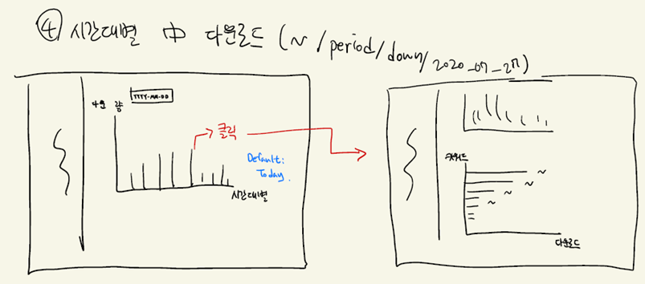
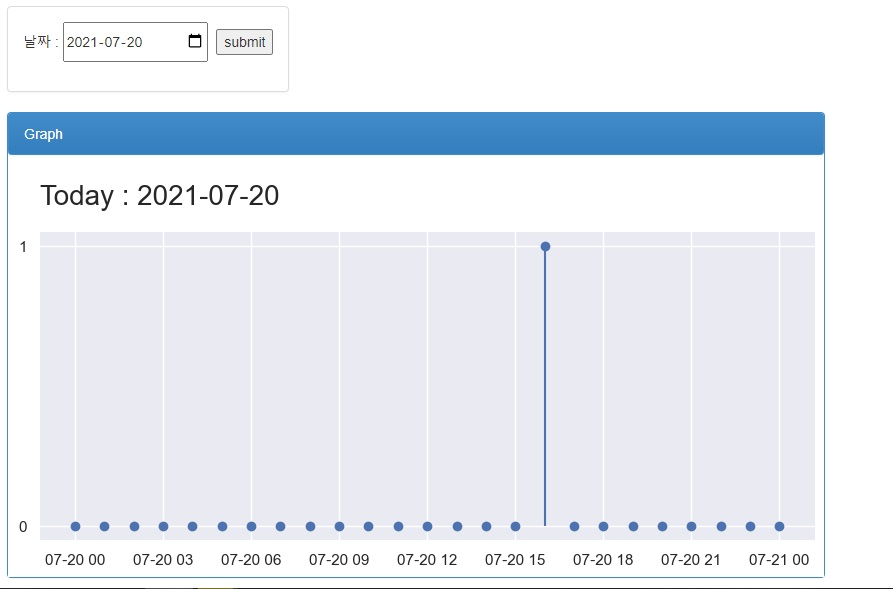

# Voice Quiz Let APP Service

## Description

- 사용자 관리 통계 페이지 구축

## Draft Plan

### 1

- 모든 통계 페이지에는 공통으로 excel export 기능이 있습니다.
- 왼쪽에는 로고와 카테고리들을 배치하였습니다.
  - 카드목록
  - 시간대 별 접속자 수
  - 시간대 별 검색한 키워드
  - 시간대 별 다운로드한 키워드
  - 시간대 별 제작한 키워드

- 메인 페이지에는 누적 이용자 수, 어제 이용자 수, 오늘의 이용자 수를 보여줍니다.
- 어제 이용자 수는 0시~24시, 오늘의 이용자 수는 0시부터 실시간까지의 누적 이용자 입니다.
- 하단에는 일주일 동안의 사용자를 요일 별로 표시하였습니다.
- 우측 하단에는 좋아요 수가 많은 순으로 5개의 카드를 뽑았습니다.

### 2

- 카드 목록에 들어가면 좋아요 순으로 정렬되어 카드들이 나옵니다.
- 검색을 하면 앱과 같은 검색함수를 통하여 검색된 내용들이 나옵니다.
- 카드를 선택하면 카드의 정보들이 나오게 됩니다.

### 3

- 구간의 처음과 끝, 단위를 설정하면 그래프로 그려줍니다.

### 4

- 날짜를 설정하면 시간대 별 검색 양이 나옵니다.
- 검색 양을 클릭하면 키워드 별로 검색 양이 나옵니다.

### 5

- 날짜를 설정하면 시간대 별 다운로드 양이 나옵니다.
- 다운로드 양을 클릭하면 키워드 별로 다운로드 양이 나옵니다.

### 6

- 날짜를 설정하면 시간대 별 제작 양이 나옵니다.
- 제작 양을 클릭하면 키워드 별로 제작 양이 나옵니다.

## Draft imgs

